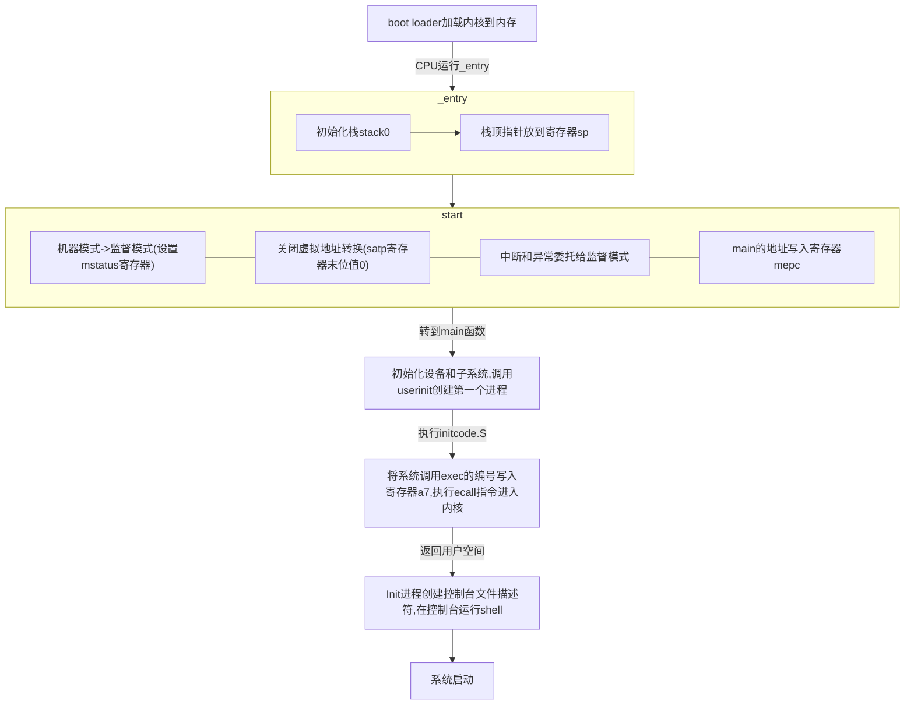

# System Call

## 预备知识

将硬件资源抽象为服务，将各个进程隔离；RISC-V的CPU可运行在`machine`模式，`supervisor`模式，`user`模式，`ecall`指令可以切换模式

内核的组织存在两种，为`monolithic kernel`和`microkernel`,前者设计更为方便，操作系统内核的各部分协作更方便，但对于使用者来说更易于出错，后者最小化执行在`supervisor`模式的代码，将大体量的操作系统执行在用户模式，xv6采用monolithic kernel.

进程抽象使程序拥有独立的地址空间，并给程序提供拥有整个硬件资源的假象，xv6使用页表给进程提供独占的地址空间，RISC-V的页表将虚拟地址`virtual address`转换为物理地址`physical address`

对于64位的RISC-V指令集，xv6使用38位作为寻址范围，最大地址为0x3fffffffff,在xv6的地址空间的顶端有在用户空间和内核空间之间跳转的页表*trampoline*和*trapframe*,前者包含进出内核的代码

xv6内核将进程的有关信息保存在结构体`struct proc`中，每个进程包含一个执行线程，线程的信息存储在栈中，每个进程包含两个栈，用户栈和内核栈，进程执行ecall指令，提升硬件特权级，进入内核态执行系统调用，`sret`指令降低硬件特权级并返回到用户指令继续执行。

RISC-V计算机启动后会首先加载*boot loader*,引导装载程序初始化硬件，将内核装入内存，首先在`machine`模式下，CPU从[`_entry`](https://github.com/mit-pdos/xv6-riscv/blob/759bb34113d214819b2f01b2c38c0b36a5ca775b/kernel/entry.S#L7)开始运行xv6,

```.S
    .section .text
    .global _entry
    _entry:
        # set up a stack for C.
        # stack0 is declared in start.c,
        # with a 4096-byte stack per CPU.
        # sp = stack0 + (hartid * 4096)
        la sp, stack0
        li a0, 1024*4
        csrr a1, mhartid
        addi a1, a1, 1
        mul a0, a0, a1
        add sp, sp, a0
        # jump to start() in start.c
        call start    
```

la指令常用来加载一个变量或函数的地址(具体见[RISCV汇编](https://blog.csdn.net/qq_38915354/article/details/118460201)),CSR是RISCV的控制与状态寄存器(control and status registers)，这些寄存器能够控制和反映当前CPU的状态和执行机制，典型的如`mstatus`,包含很多与CPU执行机制有关的状态位，`csrr`指令读取一个CSR的值到通用寄存器(详情可见[RISCV特权指令入门](https://juejin.cn/post/6891962672892837901))

    csrr t0, mstatus  # 读取mstaus值到t0
    csrw mstatus, t0  # 将t0的值写入mstatus

C语言中可以嵌入汇编代码(详情见[C语言的内嵌汇编](https://zhuanlan.zhihu.com/p/348372132))，其语法格式为

    asm volatile( /* volatile : 可选，禁止编译器对汇编代码进行优化 */
    "汇编指令"   /* 汇编指令间使用'\n'分隔 */
    :"=限制符"(输出参数)
    :"限制符"(输入参数)
    :保留列表
    )

在GNU C中利用`__attribute__`机制设置函数属性，变量属性和类型属性(详情见[C语言__attribute__的使用](https://blog.csdn.net/qlexcel/article/details/92656797))

    __attribute__ ((aligned (16)))      // 分配空间时采用16字节对齐方式

mrep是machine模式的一个寄存器，全称为Machine Exception Program Counter，详情见[machine寄存器](https://blog.csdn.net/humphreyandkate/article/details/112941145)，satp(Supervisor Address Translation and Protection，监管者地址转换和保护)是`supervisor`模式下的一个寄存器，低32位保存了根页表的物理地址,详情见[知乎文章-页表简介](https://zhuanlan.zhihu.com/p/61430196)




